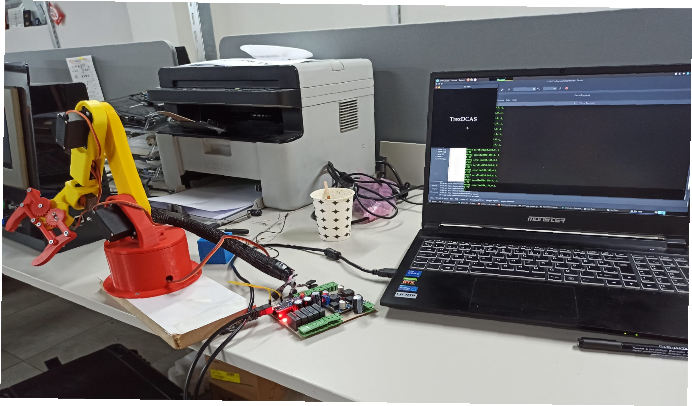

# DOF5_Robot_Arm_Electronics
 This project encompasses the design of a 5-degree-of-freedom (DOF) robot arm, fabricated using a 3D printer, along with the construction of its circuit board.

# Endüstriyel 3D Robot Kol Kontrol Projesi

Bu proje, endüstriyel ortamlarda kullanılmak üzere tasarlanmış bir 3D robot kolunun kontrolünü sağlamayı amaçlayan kapsamlı bir projedir. Proje kapsamında, robot kolunun hareketini ve işlevselliğini kontrol etmek üzere bir devre kartı tasarlanmış ve üretilmiştir. Aynı zamanda 3D baskı teknolojisi kullanılarak robot kolunun fiziksel prototipi oluşturulmuştur.

## Proje Aşamaları

### 1. Devre Kartı Tasarımı

Projenin ilk aşaması, endüstriyel standartlara uygun giriş ve çıkış portlarıyla sınırlı olan bir devre kartının tasarımını içerir. Bu devre kartı, endüstriyel sensörlerin ve diğer harici bileşenlerin entegrasyonunu sağlamak üzere optimize edilmiştir.

### 2. Devre Kartının Asit Öncesi Durumu

Devre kartının asit işlemine girmeden önceki durumu, tasarımın prototipe dönüştürülmesi aşamasını temsil eder.

### 3. Devre Kartının Asit İçerisindeki Durumu

Devre kartının asit içerisindeki durumu, üretim aşamasının bir parçasını yansıtır.

### 4. Devre Kartının Asit Sonrası Durumu

Devre kartının asit sonrası durumu, üretim sürecinin bir aşamasını gösterir.

### 5. Devre Kartının Çalışma Halindeki Görünümü

Devre kartının çalışma halindeki görüntüsü, projenin işlevselliğini yansıtır.

### 6. Başka Bir Çalışma Görünümü

Alternatif bir çalışma görünümü, projenin detaylarına daha fazla bakış sağlar.

### 7. SMD Bileşen Dizilimi

Devre kartının üst katmanındaki SMD bileşenlerinin dizilimi.

### 8. Projenin Son Hali

Projenin son halini temsil eden görüntü.

### 9. Ön Çapraz Görünüm

Robotun ön çapraz görünümünü yansıtan resim.

### 10. Ön Görünüm

Robotun önden görünümünü yansıtan resim.

### 11. Bilgi

Projeye ait genel bilgi ve iletişim detayları.

### 12. PCB İlk Katman Görünümü

PCB'nin ilk katman görünümü.

### 13. Üst Katman Yolları

PCB'nin üst katmanında yer alan uzay yolu adı verilen kabloların görünümü.

## İletişim ve Katkılar

Projeye her türlü katkı ve geri bildirim memnuniyetle karşılanmaktadır. Sorularınız veya katkılarınız için lütfen bir "issue" açmaktan veya bizimle iletişime geçmekten çekinmeyin. Projemiz, endüstriyel otomasyonun geliştirilmesine katkıda bulunmayı amaçlar ve her türlü destek ve işbirliği değerlidir.
