# DOF5_Robot_Arm_Electronics
 This project encompasses the design of a 5-degree-of-freedom (DOF) robot arm, fabricated using a 3D printer, along with the construction of its circuit board.
# Industrial 3D Robot Arm Control Project

This project encompasses the design and development of an electronic module specifically designed for controlling an industrial 3D robot arm. The module, also known as the control board, focuses on efficiently managing the arm's movements and functionalities. Additionally, the project involves the creation of a physical prototype of the robot arm using 3D printing technology.

## Project Description

The core objective of this project is to enable precise control of the industrial 3D robot arm in various settings. The control board is strategically designed to facilitate seamless interaction with the external world through a set of input and output ports. These ports conform to industrial standards and allow integration of sensors, switches, and other external devices, empowering the robot arm to perform diverse industrial tasks.

The main control unit on the board is an electronic component engineered to oversee the intricate motions of the robot arm. This unit processes the necessary control commands to determine the arm's movements, ensure coordination, and execute desired functions accurately.

The project's focal point revolves around a control board equipped with industrial-grade input and output ports. This board serves as an intermediary, coordinating and controlling the movements of the 3D robot arm. The project aims to contribute to the development and optimization of industrial automation processes.

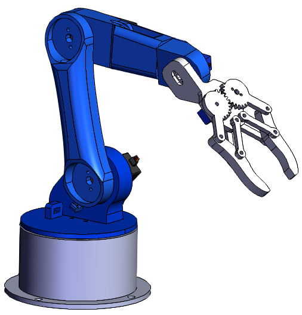

## Project Phases

### 1. Robot Arms: Basic Information

**Degrees of Freedom (DOF):** The movement capability of robot arms is determined by the degrees of freedom they possess. Degrees of freedom indicate how many different ways a robot arm can move. For example, the human arm has three degrees of freedom—shoulder, elbow, and wrist movements.

**Industrial Use:** Industrial robot arms are employed for tasks such as material handling, assembly, welding, and painting on production lines. These robot arms can perform precise and repetitive tasks more quickly and efficiently than human labor.

**Medical and Surgical Fields:** Robot arms are used in surgical applications to assist surgeons in performing precise and controlled movements during operations.

**Research and Development:** Robot arms are utilized in research and development efforts within the field of robotics. They are used to test new algorithms, develop artificial intelligence applications, and explore autonomous movement capabilities.

**Control Systems:** Robot arms are typically controlled by specialized control systems. These control systems allow users or programs to manage the robot arm's movements, speed, position, and other parameters.

**Haptic Feedback:** Advanced robot arms can provide haptic feedback using tactile sensors. This enables the robot arm to mimic sensory experiences such as touch and pressure.

**Learning Capability:** Some robot arms can adapt to their surroundings through learning algorithms and artificial intelligence techniques. These robot arms can recognize objects in their environment and learn new tasks.

The design and application areas of robot arms are extensive and diverse. They find use in industrial automation, medical surgery, space exploration, automotive industry, service sector, and many other fields.

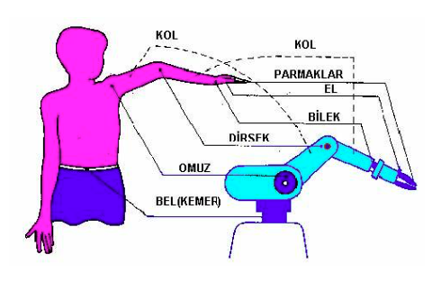

### 2. Circuit Design

#### First Layer View of the PCB

The PCB for this project has been designed as a single-layer board and is intended to be produced using the toner transfer method. At this stage, the PCB and schematic drawings can be found in the "hardware" section. Additionally, you can visit the project's EasyEDA page for more details: [3D Robot Arm Electronics - EasyEDA](https://oshwlab.com/aekeren/trex_staj)

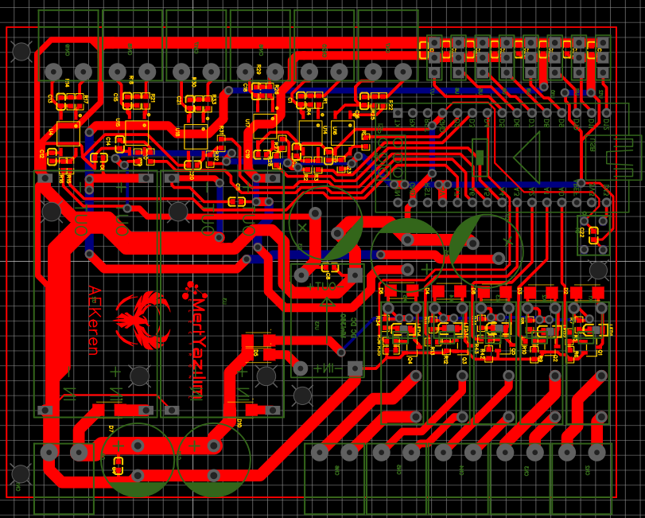

### 3. Bill of Materials (BOM)

The planned material list for the project is shown in the provided BOM (Bill of Materials) list below. Quantities and packages of the materials are specified.

You can find the path to the BOM list in .csv format by following this link: (Hardware/BOM_PCB_Trex_Staj v2.0_2022-07-13.csv)

### 4. Pre-Etching State of the PCB

At this stage, the pre-etching state of the PCB is observed before undergoing the acid process. This state represents the prototype phase of the design.

Commonly used chemicals during the acid process include hydrochloric acid (HCl), hydrogen peroxide (H₂O₂), and cupric chloride (CuCl₂). These chemicals are utilized for cleaning the copper surface and preparing it for soldering.

Equations for the acid process:
HCl + H₂O₂ → CuCl₂ + H₂O
Hydrochloric Acid + Hydrogen Peroxide → Cupric Chloride + Water

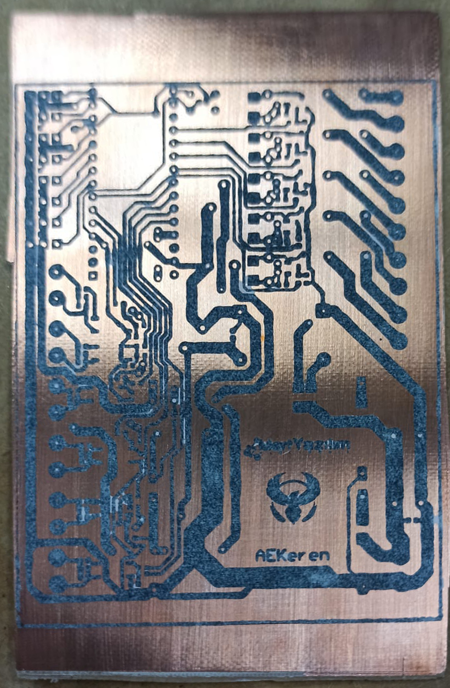

### 5. State of the PCB During Etching

At this stage, the PCB undergoes the etching process, representing a part of the manufacturing phase.

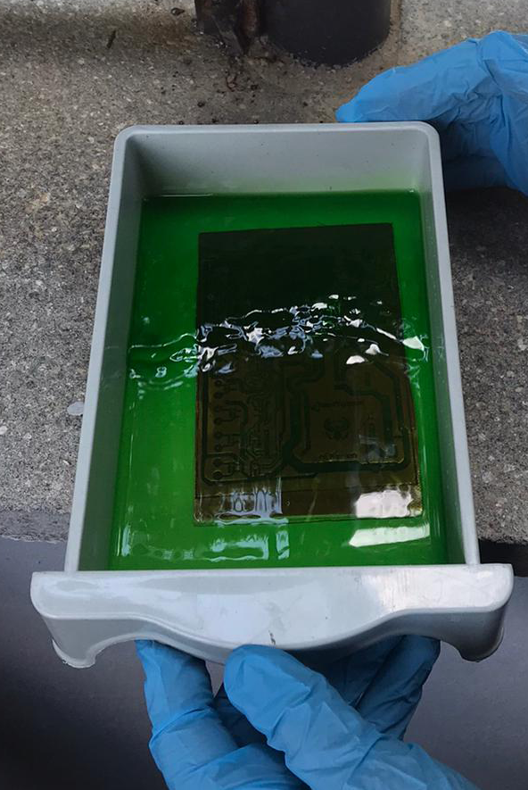

### 6. State of the PCB After Etching

At this stage, the condition of the PCB after the etching process is depicted, representing a part of the manufacturing process.

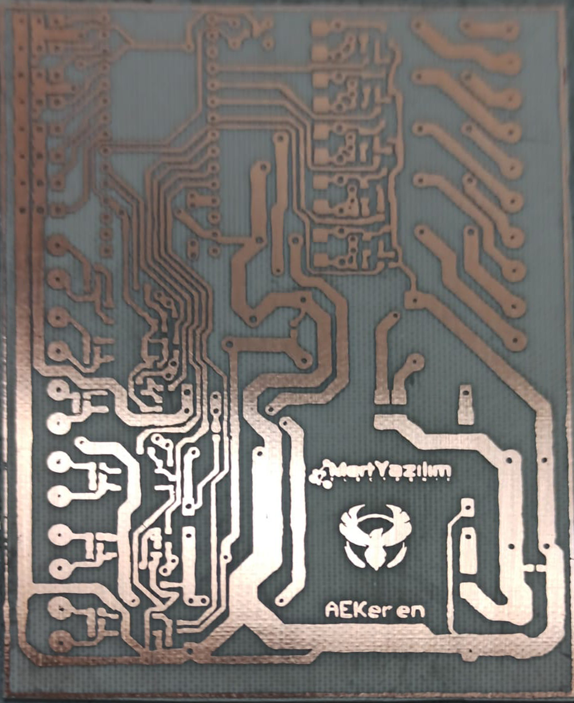

### 7. SMD Component Placement

This section illustrates the arrangement of Surface Mount Device (SMD) components on the top layer of the PCB.

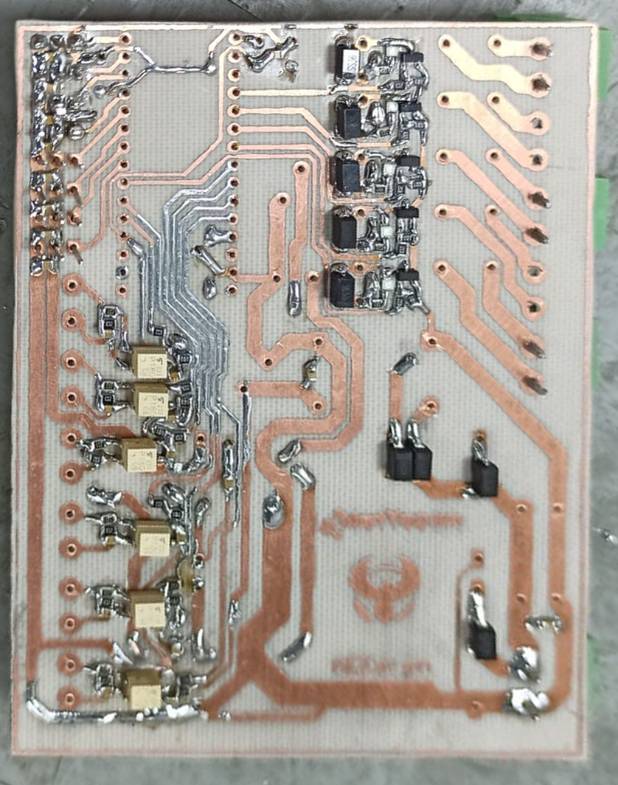

### 8. Top Layer Traces

This section provides a visual representation of the traces, also known as "traces," on the top layer of the PCB.

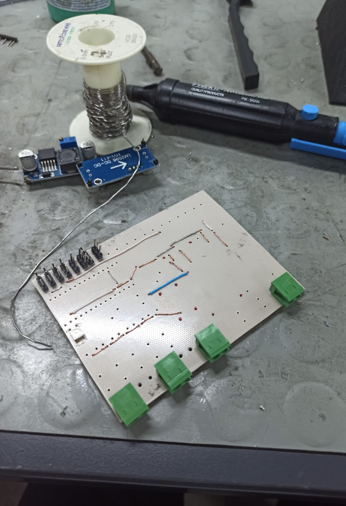

### 9. Operational View of the PCB

This section showcases the operational view of the PCB, reflecting the functionality of the project.

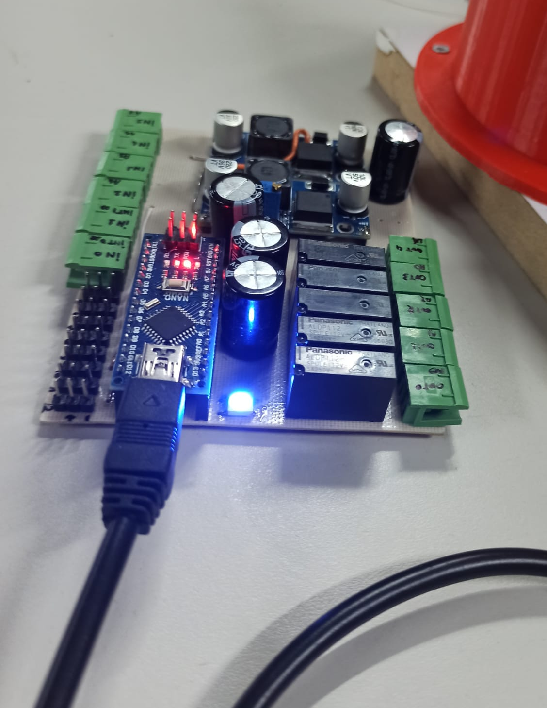

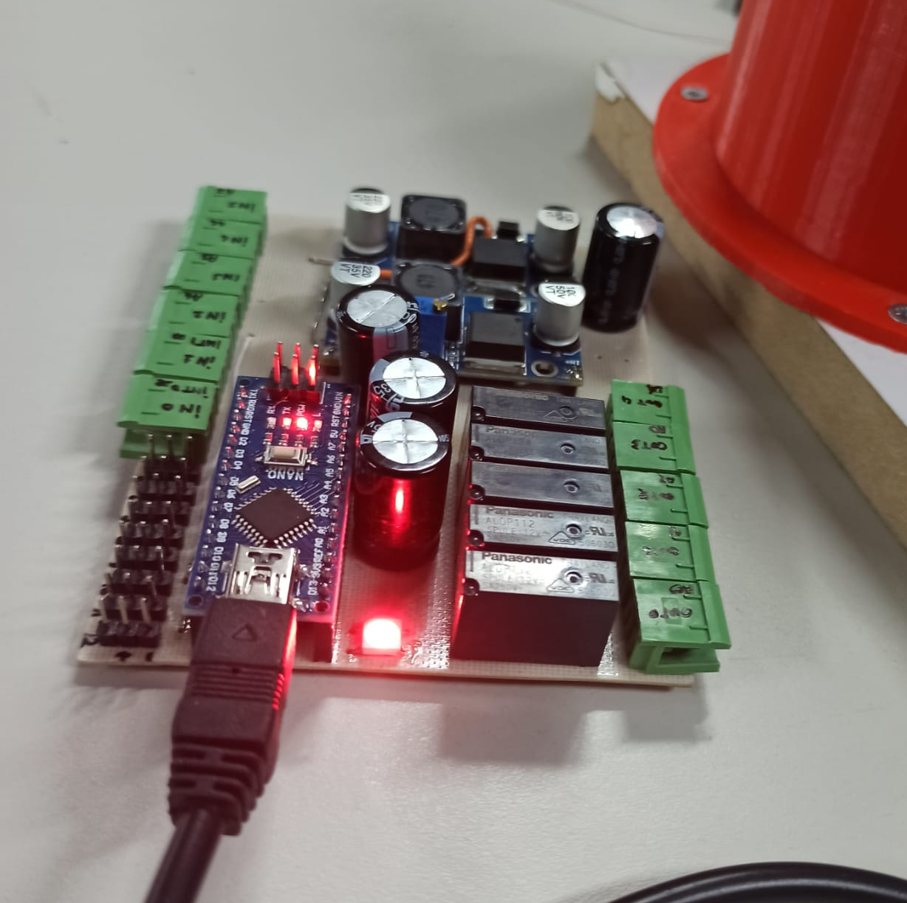

### 10. Final State of the Project

This section features an image representing the final state of the project.

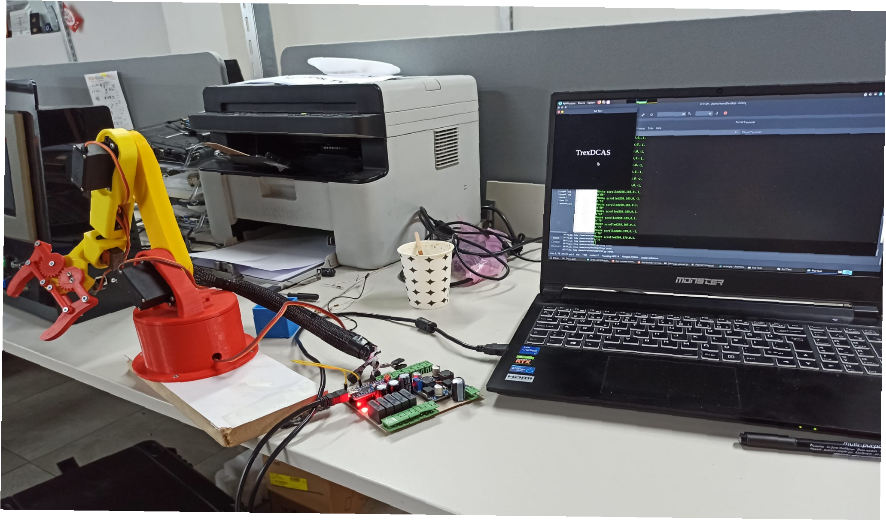

### 11. Front Oblique View

In this section, an image depicting the front oblique view of the robot is provided.

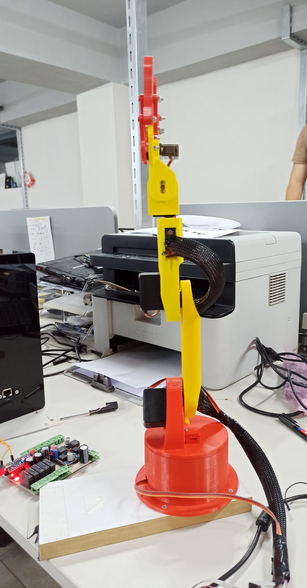

### 12. Front View

This section contains an image reflecting the front view of the robot.

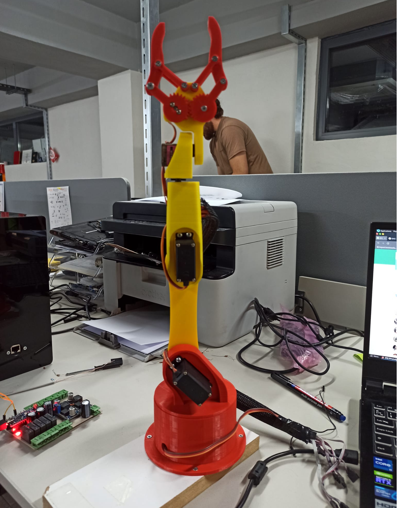

## Contact and Contributions

Any contributions and feedback to the project are welcomed with great enthusiasm. Please don't hesitate to open an "issue" or reach out to me for any questions or contributions. Our project aims to contribute to the advancement of industrial automation, and any form of support and collaboration is highly valued.

